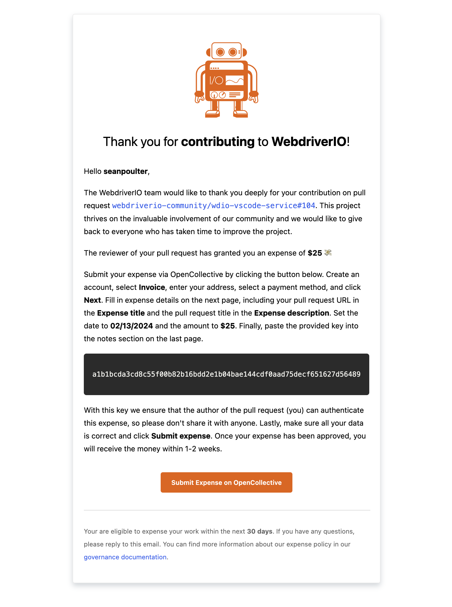

# WebdriverIO Expense Action

[](https://github.com/super-linter/super-linter)

[](https://github.com/actions/typescript-action/actions/workflows/check-dist.yml)

---

> A GitHub Action that enables WebdriverIO TSC members to grant expense requests
> for contributed PRs to the project.

This GitHub Action enables the allocation of funds for contributions received by the WebdriverIO project. It allows us to set up a simple workflow everywhere and use the same process, independent of the GitHub repository we receive the contribution.

After triggering the workflow providing a pull request number and the expansible amount, the action finds the author of the commit and their respective email and sends an automated generated Email using [resend.com](https://resend.com/):



The receiver can use the code to expense their contribution given the granted amount and by providing the code from the email.

## Usage

Create a workflow file in a WebdriverIO ecosystem project:

```yaml
name: Expense Contribution

on:
    workflow_dispatch:
        inputs:
            prNumber:
                description: 'Number of the PR (without #)'
                required: true
            amount:
                description:
                    'The expense amount you like to grant for the contribution
                    in $'
                required: true
                type: choice
                default: 'patch'
                options:
                    - 25
                    - 50
                    - 100
                    - 150
                    - 200
                    - 250
                    - 300
                    - 350
                    - 400
                    - 450
                    - 500
                    - 550
                    - 600
                    - 650
                    - 700
                    - 750
                    - 800
                    - 850
                    - 900
                    - 950
                    - 1000

jobs:
    # (optional): make sure that the expense workflow is triggered
    # by someone connected to a certain team, e.g. `technical-steering-committee`
    authorize:
        runs-on: ubuntu-latest
        steps:
            - uses: octokit/request-action@v2.1.9
              with:
                  route: GET /orgs/:organisation/teams/:team/memberships/${{ github.actor }}
                  team: technical-steering-committee
                  organisation: webdriverio
              env:
                  GITHUB_TOKEN: ${{ secrets.WDIO_BOT_GITHUB_TOKEN }}
    expense:
        needs: [authorize]
        runs-on: ubuntu-latest
        permissions:
            contents: write
            id-token: write
        steps:
            - name: Run Expense Flow
              uses: webdriverio/expense-action@v1
              with:
                  prNumber: ${{ github.event.inputs.prNumber }}
                  amount: ${{ github.event.inputs.amount }}
              env:
                  RESEND_API_KEY: ${{ secrets.RESEND_API_KEY }}
                  GH_TOKEN: ${{ secrets.WDIO_BOT_GITHUB_TOKEN }}
```

Then make sure to add `wdio-bot` as project admin so the workflow can properly
label the issue if needed and comment on it.

## Fork it!

If you like to automate the expense process of your project and like to use this GitHub Action, please do so! All you need is to:

- fork the project
- create a GitHub bot account (or use your user account) that has admin access to all repositories you like to use this workflow for
- generate an access token for that account and replace it with `WDIO_BOT_GITHUB_TOKEN` and make it accessible to all repositories in your organization
- update the text within the [mail template](https://github.com/webdriverio/expense-action/blob/main/src/mail.tsx)

---

For more information on WebdriverIO expense policies, take a look at the [governance](https://github.com/webdriverio/webdriverio/blob/main/GOVERNANCE.md#sponsoring-and-donations) docs.
